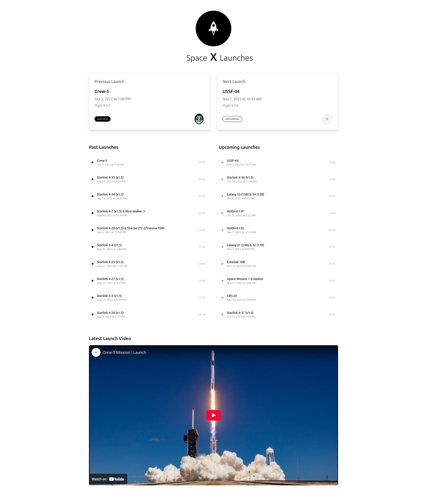
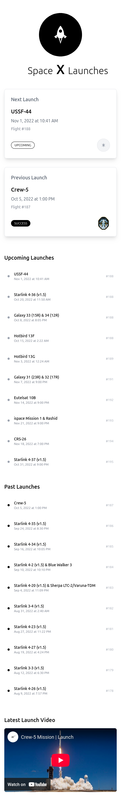

# 🚀 SpaceX Launches – Fullstack Project

A modern fullstack application to display detailed information about SpaceX launches, including the next, previous, upcoming, and past missions. It features a clean UI powered by React and Tailwind CSS, and a custom backend wrapper built with Node.js and TypeScript that consumes the official SpaceX API.

## 🌍 Project Overview

- **Frontend**: React + TypeScript + Vite + Tailwind CSS
- **Backend**: Node.js + Express + TypeScript
- **Features**:
  - Displays next and previous launches with patches and webcast links.
  - Lists upcoming and past launches.
  - Responsive UI optimized for mobile and desktop.
  - Caching and re-fetching via React Query.
  - Video embed for previous launch webcast.

## 🧾 Project Structure

spacex-launches/
├── back-end/
│   ├── src/
│   │   ├── routes/
│   │   ├── services/
│   │   └── index.ts       # Express entry point
│   ├── .env               # BACKEND_PORT, CORS config
│   ├── package.json
│   └── tsconfig.json
│
├── spacex-launches-ui/
│   ├── public/
│   ├── src/
│   │   ├── components/
│   │   ├── hooks/
│   │   ├── pages/
│   │   ├── services/
│   │   └── main.tsx       # App entry
│   ├── .env               # VITE_SPACEX_API_URL
│   ├── package.json
│   └── tailwind.config.js
│
├── README.md              # This file
└── ...

## ⚙️ Getting Started

### 🧩 Prerequisites

- Node.js `>=18`
- npm or pnpm
- Backend and frontend must be started separately

## 📦 Installation

```bash
# 1. Clone the repo
git clone https://github.com/your-username/spacex-launches.git
cd spacex-launches

# 2. Install dependencies in both frontend and backend
cd back-end && npm install
cd ../spacex-launches-ui && npm install
```

## 🔧 Configuration
### Backend (`.env in /back-end`):

```bash
PORT=3000
CORS_ORIGIN=http://localhost:5173
```

### Frontend (`.env in /spacex-launches-ui`):

```bash
VITE_SPACEX_API_URL=http://localhost:3000
```

## 🚀 Running the App

### Backend

```bash
cd back-end
npm run dev
# Starts server on http://localhost:3000
```

### Frontend

```bash
cd spacex-launches-ui
npm run dev
# Opens app at http://localhost:5173
```

## 📄 API Overview
Endpoint: `GET /launches/summary`

Returns:

```bash
{
  "next": { /* Next launch details */ },
  "previous": { /* Previous launch details */ },
  "upcoming": [ /* Array of upcoming launches */ ],
  "past": [ /* Array of past launches */ ]
}
```

## 📸 UI Preview





## 🛠 Tech Stack
### Frontend:
- React
- Vite
- TypeScript 
- Tailwind CSS
- React Query
- Lucide Icons

### Backend:
- Express.js
- Node.js
- TypeScript
- SpaceX API